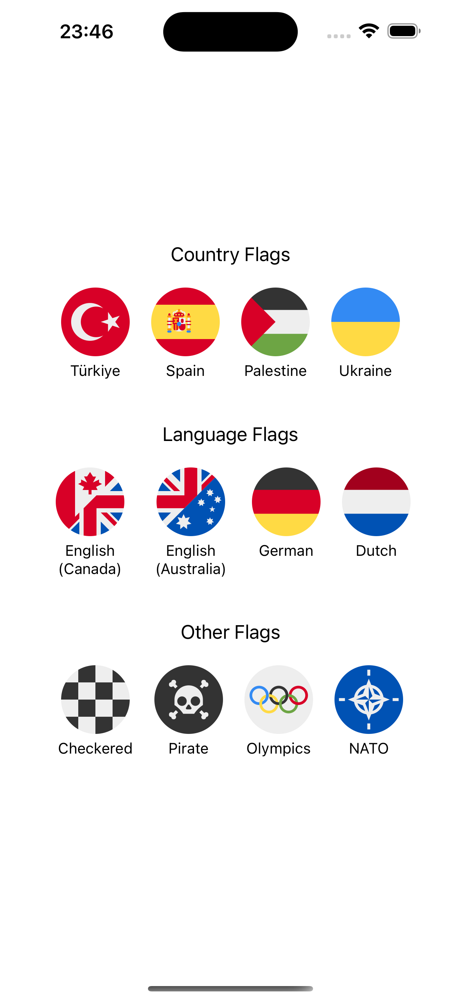

# react-native-circle-flags

<p align="center">
  
</p>

React Native components for **400+ minimal circular flags** — countries, states, languages, and more. Optimized WebP images adapted from [HatScripts/circle-flags](https://github.com/HatScripts/circle-flags).

## ✨ Features

- 🌍 **400+ flags** — Countries, states, territories, languages, and special flags
- 📦 **Tree-shakeable** — Import only the flags you need
- 🎯 **TypeScript support** — Full type definitions with autocomplete
- ⚡ **Optimized** — WebP format for smaller bundle size
- 🧩 **Flexible** — Use as components or raw image sources

## 📦 Installation

```sh
npm install react-native-circle-flags
# or
yarn add react-native-circle-flags
```

## 🚀 Usage

### Method 1: Direct Flag Imports (Recommended)

Import individual flags for the smallest bundle size:

```tsx
// Import as component
import TrFlag from 'react-native-circle-flags/country/tr-flag';
import EnFlag from 'react-native-circle-flags/language/en-flag';
import NatoFlag from 'react-native-circle-flags/other/nato-flag';

// Import as image source
import { TrFlagSource } from 'react-native-circle-flags/country/tr-flag';
import { EnFlagSource } from 'react-native-circle-flags/language/en-flag';
import { NatoFlagSource } from 'react-native-circle-flags/other/nato-flag';

// Usage
<TrFlag size={64} />
<EnFlag size={64} />
<NatoFlag size={64} />
<Image source={TrFlagSource} style={{ width: 64, height: 64 }} />
```

> 💡 **Bundle Size Tip:** Using `<TrFlag />` instead of `<CircleCountryFlag code="tr" />` reduces your bundle size by **~5.2MB** because it only includes the flags you actually use.

### Method 2: Using Flag Components

```tsx
import CircleCountryFlag from 'react-native-circle-flags/country';
import CircleLanguageFlag from 'react-native-circle-flags/language';
import CircleOtherFlag from 'react-native-circle-flags/other';

// Usage
<CircleCountryFlag code="tr" size={64} />
<CircleLanguageFlag code="en" size={64} />
<CircleOtherFlag code="nato" size={64} />
```

> ⚠️ **Note:** This method imports all 400+ flag assets (~5.2MB for countries). Use [Method 1](#method-1-direct-flag-imports-recommended) for smaller bundles.

### Method 3: Using Flag Assets

```tsx
import { CountryFlags } from 'react-native-circle-flags/country';
import { LanguageFlags } from 'react-native-circle-flags/language';
import { OtherFlags } from 'react-native-circle-flags/other';

// Usage
<Image source={CountryFlags['tr']} style={{ width: 64, height: 64 }} />
<Image source={LanguageFlags['en']} style={{ width: 64, height: 64 }} />
<Image source={OtherFlags['nato']} style={{ width: 64, height: 64 }} />
```

> ⚠️ **Note:** This method also imports all flag assets for the category.

## 📖 API Reference

### Components

```tsx
import CircleCountryFlag from 'react-native-circle-flags/country';
import CircleLanguageFlag from 'react-native-circle-flags/language';
import CircleOtherFlag from 'react-native-circle-flags/other';

<CircleCountryFlag code="tr" size={32} style={...} />
<CircleLanguageFlag code="en" size={32} style={...} />
<CircleOtherFlag code="nato" size={32} style={...} />
```

**Props:**

- `code`: `CountryCode` | `LanguageCode` | `OtherCode` — Required. Flag code
- `size`: `number` — Optional. Flag size in pixels (default: `32`)
- `style`: `ImageStyle` — Optional. Additional image styles

### Types

```tsx
import {
  type CountryCode,
  COUNTRY_CODES,
  CountryFlags,
} from 'react-native-circle-flags/country';
import {
  type LanguageCode,
  LANGUAGE_CODES,
  LanguageFlags,
} from 'react-native-circle-flags/language';
import {
  type OtherCode,
  OTHER_CODES,
  OtherFlags,
} from 'react-native-circle-flags/other';

// Type-safe codes
const country: CountryCode = 'tr';
const language: LanguageCode = 'en';
const other: OtherCode = 'nato';

// Arrays of all available codes
COUNTRY_CODES; // ['ad', 'ae', 'af', ...]
LANGUAGE_CODES; // ['aa', 'ab', 'af', ...]
OTHER_CODES; // ['checkered', 'earth', ...]

// Flag asset mappings (Record<Code, ImageSourcePropType>)
CountryFlags['tr'];
LanguageFlags['en'];
OtherFlags['nato'];
```

## 🌍 Available Flags

Explore all available flags in the [Flag Gallery](https://hatscripts.github.io/circle-flags/gallery).

## 🙏 Credits

- Flag designs from [HatScripts/circle-flags](https://github.com/HatScripts/circle-flags)
- Built with [create-react-native-library](https://github.com/callstack/react-native-builder-bob)
