<link rel="stylesheet" type="text/css" href="gallery.css" />

<h1>Gallery</h1>

<h2>Main flags</h2>

Usage:
```text
https://hatscripts.github.io/circle-flags/flags/xx.svg
```
(Where `xx` is the [ISO 3166-1 alpha-2 code](https://www.iso.org/obp/ui/#search/code/) of a country).

<div class="container">
  <div><p>Andorra (<code>ad</code>)</p></div>
  <div><p>United Arab Emirates (<code>ae</code>)</p></div>
  <div><p>Afghanistan (<code>af</code>)</p></div>
  <div><p>Afghanistan</p></div>
  <div><p>Antigua and Barbuda (<code>ag</code>)</p></div>
  <div><p>Anguilla (<code>ai</code>)</p></div>
  <div><p>Albania (<code>al</code>)</p></div>
  <div><p>Armenia (<code>am</code>)</p></div>
  <div><p>Netherlands Antilles (<code>an</code>)</p></div>
  <div><p>Angola (<code>ao</code>)</p></div>
  <div><p>Antarctica (<code>aq</code>)</p></div>
  <div><p>Antarctica (True South)</p></div>
  <div><p>Argentina (<code>ar</code>)</p></div>
  <div><p>Artsakh</p></div>
  <div><p>American Samoa (<code>as</code>)</p></div>
  <div><p>Austria (<code>at</code>)</p></div>
  <div><p>Australia (<code>au</code>)</p></div>
  <div><p>Australian Aboriginal</p></div>
  <div><p>Torres Strait Islands</p></div>
  <div><p>Australian Capital Territory (<code>au-act</code>)</p></div>
  <div><p>New South Wales (<code>au-nsw</code>)</p></div>
  <div><p>Northern Territory (<code>au-nt</code>)</p></div>
  <div><p>Queensland (<code>au-qld</code>)</p></div>
  <div><p>South Australia (<code>au-sa</code>)</p></div>
  <div><p>Tasmania (<code>au-tas</code>)</p></div>
  <div><p>Victoria (<code>au-vic</code>)</p></div>
  <div><p>Western Australia (<code>au-wa</code>)</p></div>
  <div><p>Aruba (<code>aw</code>)</p></div>
  <div><p>Åland Islands (<code>ax</code>)</p></div>
  <div><p>Azerbaijan (<code>az</code>)</p></div>
  <div><p>Bosnia and Herzegovina (<code>ba</code>)</p></div>
  <div><p>Barbados (<code>bb</code>)</p></div>
  <div><p>Bangladesh (<code>bd</code>)</p></div>
  <div><p>Belgium (<code>be</code>)</p></div>
  <div><p>Burkina Faso (<code>bf</code>)</p></div>
  <div><p>Bulgaria (<code>bg</code>)</p></div>
  <div><p>Bahrain (<code>bh</code>)</p></div>
  <div><p>Burundi (<code>bi</code>)</p></div>
  <div><p>Benin (<code>bj</code>)</p></div>
  <div><p>Saint Barthélemy (<code>bl</code>)</p></div>
  <div><p>Bermuda (<code>bm</code>)</p></div>
  <div><p>Brunei (<code>bn</code>)</p></div>
  <div><p>Bolivia (<code>bo</code>)</p></div>
  <div><p>Bonaire (<code>bq-bo</code>)</p></div>
  <div><p>Saba (<code>bq-sa</code>)</p></div>
  <div><p>Sint Eustatius (<code>bq-se</code>)</p></div>
  <div><p>Brazil (<code>br</code>)</p></div>
  <div><p>Bahamas (<code>bs</code>)</p></div>
  <div><p>Bhutan (<code>bt</code>)</p></div>
  <div><p>Bouvet Island (<code>bv</code>)</p></div>
  <div><p>Botswana (<code>bw</code>)</p></div>
  <div><p>Belarus (<code>by</code>)</p></div>
  <div><p>Belize (<code>bz</code>)</p></div>
  <div><p>Canada (<code>ca</code>)</p></div>
  <div><p>British Columbia (<code>ca-bc</code>)</p></div>
  <div><p>Quebec (<code>ca-qc</code>)</p></div>
  <div>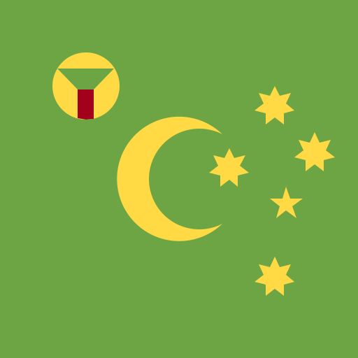<p>Cocos (Keeling) Islands (<code>cc</code>)</p></div>
  <div><p>Congo, Democratic Republic of the (<code>cd</code>)</p></div>
  <div><p>Central African Republic (<code>cf</code>)</p></div>
  <div><p>Congo (<code>cg</code>)</p></div>
  <div><p>Switzerland (<code>ch</code>)</p></div>
  <div><p>Grisons (<code>ch-gr</code>)</p></div>
  <div><p>Ivory Coast (<code>ci</code>)</p></div>
  <div><p>Cook Islands (<code>ck</code>)</p></div>
  <div><p>Chile (<code>cl</code>)</p></div>
  <div><p>Cameroon (<code>cm</code>)</p></div>
  <div><p>China (<code>cn</code>)</p></div>
  <div><p>Xinjiang (<code>cn-xj</code>)</p></div>
  <div><p>Colombia (<code>co</code>)</p></div>
  <div><p>Sark (<code>cq</code>)</p></div>
  <div><p>Costa Rica (<code>cr</code>)</p></div>
  <div><p>Cuba (<code>cu</code>)</p></div>
  <div><p>Cabo Verde (<code>cv</code>)</p></div>
  <div><p>Curaçao (<code>cw</code>)</p></div>
  <div><p>Christmas Island (<code>cx</code>)</p></div>
  <div><p>Cyprus (<code>cy</code>)</p></div>
  <div><p>Czechia (<code>cz</code>)</p></div>
  <div><p>Germany (<code>de</code>)</p></div>
  <div><p>Djibouti (<code>dj</code>)</p></div>
  <div><p>Denmark (<code>dk</code>)</p></div>
  <div><p>Dominica (<code>dm</code>)</p></div>
  <div><p>Dominican Republic (<code>do</code>)</p></div>
  <div><p>Algeria (<code>dz</code>)</p></div>
  <div><p>East African Federation</p></div>
  <div><p>Easter Island</p></div>
  <div><p>Ecuador (<code>ec</code>)</p></div>
  <div><p>Galápagos (<code>ec-w</code>)</p></div>
  <div><p>Estonia (<code>ee</code>)</p></div>
  <div><p>Egypt (<code>eg</code>)</p></div>
  <div><p>Western Sahara (<code>eh</code>)</p></div>
  <div><p>Eritrea (<code>er</code>)</p></div>
  <div>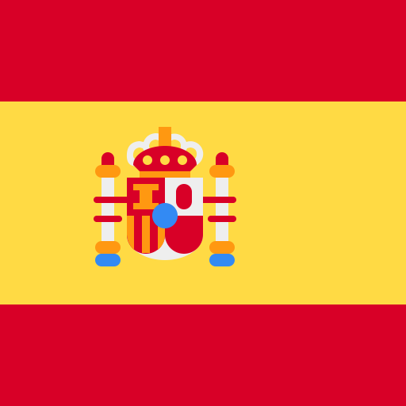<p>Spain (<code>es</code>)</p></div>
  <div><p>Spain</p></div>
  <div><p>Aragon (<code>es-ar</code>)</p></div>
  <div><p>Ceuta (<code>es-ce</code>)</p></div>
  <div><p>Canary Islands (<code>es-cn</code>)</p></div>
  <div><p>Catalonia (<code>es-ct</code>)</p></div>
  <div><p>Galicia (<code>es-ga</code>)</p></div>
  <div><p>Balearic Islands (<code>es-ib</code>)</p></div>
  <div><p>Melilla (<code>es-ml</code>)</p></div>
  <div><p>Basque Country (<code>es-pv</code>)</p></div>
  <div>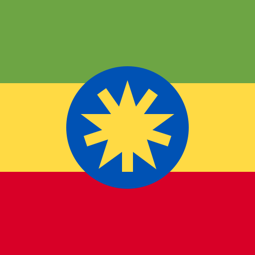<p>Ethiopia (<code>et</code>)</p></div>
  <div><p>Afar (<code>et-af</code>)</p></div>
  <div><p>Amhara (<code>et-am</code>)</p></div>
  <div><p>Benishangul-Gumuz (<code>et-be</code>)</p></div>
  <div><p>Gambela (<code>et-ga</code>)</p></div>
  <div><p>Harari (<code>et-ha</code>)</p></div>
  <div><p>Oromia (<code>et-or</code>)</p></div>
  <div><p>Sidama (<code>et-si</code>)</p></div>
  <div><p>Southern Nations, Nationalities, and Peoples' Region (<code>et-sn</code>)</p></div>
  <div><p>Somali (<code>et-so</code>)</p></div>
  <div><p>South West Region (<code>et-sw</code>)</p></div>
  <div><p>Tigray (<code>et-ti</code>)</p></div>
  <div><p>European Union (<code>eu</code>)</p></div>
  <div><p>Ewe</p></div>
  <div><p>Finland (<code>fi</code>)</p></div>
  <div><p>Fiji (<code>fj</code>)</p></div>
  <div><p>Falkland Islands (Malvinas) (<code>fk</code>)</p></div>
  <div><p>Micronesia (<code>fm</code>)</p></div>
  <div><p>Faroe Islands (<code>fo</code>)</p></div>
  <div><p>France (<code>fr</code>)</p></div>
  <div><p>Corsica (<code>fr-20r</code>)</p></div>
  <div><p>Brittany (<code>fr-bre</code>)</p></div>
  <div><p>Clipperton Island (<code>fr-cp</code>)</p></div>
  <div><p>Gabon (<code>ga</code>)</p></div>
  <div><p>United Kingdom (<code>gb</code>)</p></div>
  <div><p>Cornwall (<code>gb-con</code>)</p></div>
  <div><p>England (<code>gb-eng</code>)</p></div>
  <div><p>Northern Ireland (<code>gb-nir</code>)</p></div>
  <div><p>Orkney (<code>gb-ork</code>)</p></div>
  <div><p>Scotland (<code>gb-sct</code>)</p></div>
  <div><p>Wales (<code>gb-wls</code>)</p></div>
  <div><p>Grenada (<code>gd</code>)</p></div>
  <div><p>Georgia (<code>ge</code>)</p></div>
  <div><p>Abkhazia (<code>ge-ab</code>)</p></div>
  <div><p>French Guiana (<code>gf</code>)</p></div>
  <div><p>Guernsey (<code>gg</code>)</p></div>
  <div><p>Ghana (<code>gh</code>)</p></div>
  <div><p>Gibraltar (<code>gi</code>)</p></div>
  <div><p>Greenland (<code>gl</code>)</p></div>
  <div><p>Gambia (<code>gm</code>)</p></div>
  <div><p>Guinea (<code>gn</code>)</p></div>
  <div><p>Guadeloupe (<code>gp</code>)</p></div>
  <div><p>Equatorial Guinea (<code>gq</code>)</p></div>
  <div><p>Greece (<code>gr</code>)</p></div>
  <div><p>South Georgia and the South Sandwich Islands (<code>gs</code>)</p></div>
  <div><p>Guatemala (<code>gt</code>)</p></div>
  <div><p>Guam (<code>gu</code>)</p></div>
  <div><p>Guarani</p></div>
  <div><p>Guinea-Bissau (<code>gw</code>)</p></div>
  <div><p>Guyana (<code>gy</code>)</p></div>
  <div><p>Hausa</p></div>
  <div><p>Hong Kong (<code>hk</code>)</p></div>
  <div><p>Hmong</p></div>
  <div><p>Heard Island and McDonald Islands (<code>hm</code>)</p></div>
  <div><p>Honduras (<code>hn</code>)</p></div>
  <div><p>Croatia (<code>hr</code>)</p></div>
  <div><p>Haiti (<code>ht</code>)</p></div>
  <div><p>Hungary (<code>hu</code>)</p></div>
  <div><p>Indonesia (<code>id</code>)</p></div>
  <div><p>West Java (<code>id-jb</code>)</p></div>
  <div><p>Central Java (<code>id-jt</code>)</p></div>
  <div><p>Ireland (<code>ie</code>)</p></div>
  <div><p>Israel (<code>il</code>)</p></div>
  <div><p>Isle of Man (<code>im</code>)</p></div>
  <div><p>India (<code>in</code>)</p></div>
  <div><p>Assam (<code>in-as</code>)</p></div>
  <div><p>Gujarat (<code>in-gj</code>)</p></div>
  <div><p>Karnataka (<code>in-ka</code>)</p></div>
  <div><p>Manipur (<code>in-mn</code>)</p></div>
  <div><p>Mizoram (<code>in-mz</code>)</p></div>
  <div><p>Odisha (<code>in-or</code>)</p></div>
  <div><p>Telangana (<code>in-tg</code>)</p></div>
  <div><p>Tamil Nadu (<code>in-tn</code>)</p></div>
  <div><p>British Indian Ocean Territory (<code>io</code>)</p></div>
  <div><p>Iraq (<code>iq</code>)</p></div>
  <div><p>Kurdistan (<code>iq-kr</code>)</p></div>
  <div><p>Iran (<code>ir</code>)</p></div>
  <div><p>Iceland (<code>is</code>)</p></div>
  <div><p>Italy (<code>it</code>)</p></div>
  <div>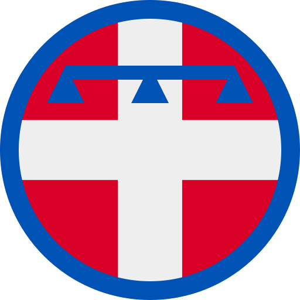<p>Piedmont (<code>it-21</code>)</p></div>
  <div>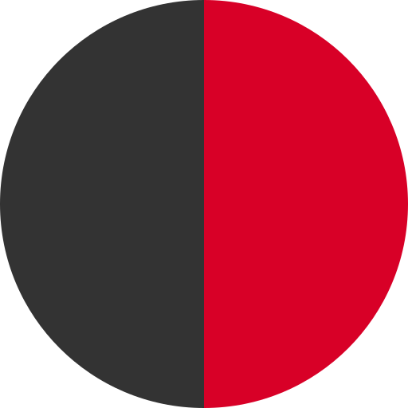<p>Aosta Valley (<code>it-23</code>)</p></div>
  <div><p>Lombardy (<code>it-25</code>)</p></div>
  <div><p>Trentino-Alto Adige (<code>it-32</code>)</p></div>
  <div><p>Veneto (<code>it-34</code>)</p></div>
  <div><p>Friuli Venezia Giulia (<code>it-36</code>)</p></div>
  <div>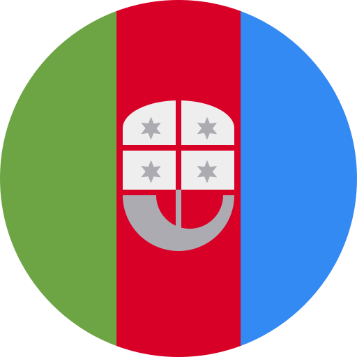<p>Liguria (<code>it-42</code>)</p></div>
  <div><p>Emilia-Romagna (<code>it-45</code>)</p></div>
  <div>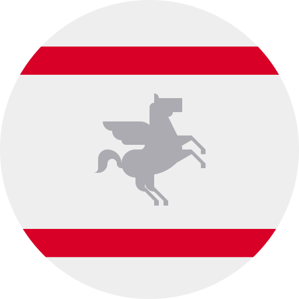<p>Tuscany (<code>it-52</code>)</p></div>
  <div><p>Umbria (<code>it-55</code>)</p></div>
  <div><p>Marche (<code>it-57</code>)</p></div>
  <div>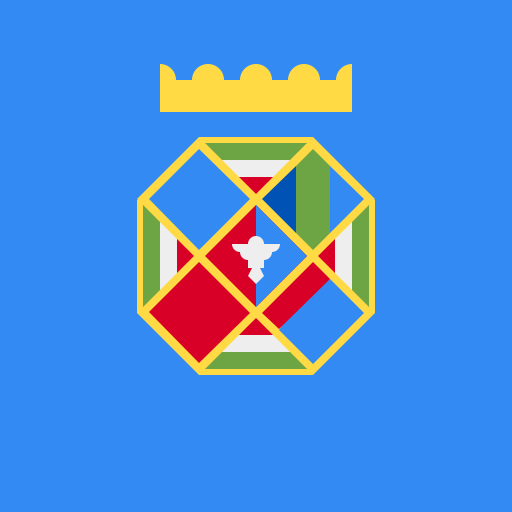<p>Lazio (<code>it-62</code>)</p></div>
  <div>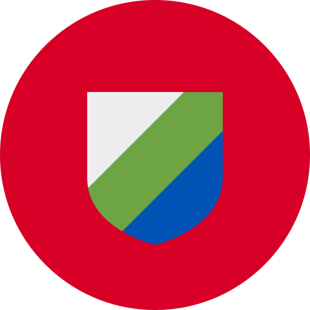<p>Abruzzo (<code>it-65</code>)</p></div>
  <div><p>Molise (<code>it-67</code>)</p></div>
  <div>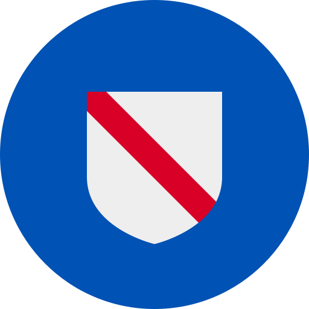<p>Campania (<code>it-72</code>)</p></div>
  <div><p>Apulia (<code>it-75</code>)</p></div>
  <div><p>Basilicata (<code>it-77</code>)</p></div>
  <div><p>Calabria (<code>it-78</code>)</p></div>
  <div><p>Sicily (<code>it-82</code>)</p></div>
  <div><p>Sardinia (<code>it-88</code>)</p></div>
  <div><p>Jersey (<code>je</code>)</p></div>
  <div><p>Jamaica (<code>jm</code>)</p></div>
  <div><p>Jordan (<code>jo</code>)</p></div>
  <div><p>Japan (<code>jp</code>)</p></div>
  <div><p>Kanuri</p></div>
  <div><p>Kenya (<code>ke</code>)</p></div>
  <div><p>Kyrgyzstan (<code>kg</code>)</p></div>
  <div><p>Cambodia (<code>kh</code>)</p></div>
  <div><p>Kiribati (<code>ki</code>)</p></div>
  <div><p>Kikuyu</p></div>
  <div>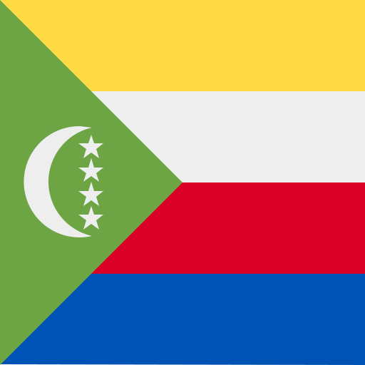<p>Comoros (<code>km</code>)</p></div>
  <div><p>Saint Kitts and Nevis (<code>kn</code>)</p></div>
  <div><p>Kongo</p></div>
  <div><p>North Korea (<code>kp</code>)</p></div>
  <div><p>South Korea (<code>kr</code>)</p></div>
  <div><p>Kuwait (<code>kw</code>)</p></div>
  <div><p>Cayman Islands (<code>ky</code>)</p></div>
  <div><p>Kazakhstan (<code>kz</code>)</p></div>
  <div><p>Laos (<code>la</code>)</p></div>
  <div><p>Lebanon (<code>lb</code>)</p></div>
  <div><p>Saint Lucia (<code>lc</code>)</p></div>
  <div><p>Liechtenstein (<code>li</code>)</p></div>
  <div><p>Sri Lanka (<code>lk</code>)</p></div>
  <div><p>Liberia (<code>lr</code>)</p></div>
  <div><p>Lesotho (<code>ls</code>)</p></div>
  <div><p>Lithuania (<code>lt</code>)</p></div>
  <div><p>Luxembourg (<code>lu</code>)</p></div>
  <div><p>Latvia (<code>lv</code>)</p></div>
  <div>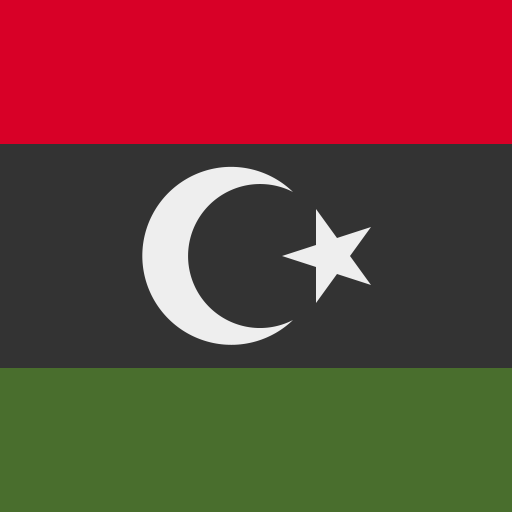<p>Libya (<code>ly</code>)</p></div>
  <div><p>Morocco (<code>ma</code>)</p></div>
  <div><p>Malayali</p></div>
  <div><p>Maori</p></div>
  <div><p>Monaco (<code>mc</code>)</p></div>
  <div><p>Moldova (<code>md</code>)</p></div>
  <div><p>Montenegro (<code>me</code>)</p></div>
  <div><p>Saint-Martin (<code>mf</code>)</p></div>
  <div><p>Madagascar (<code>mg</code>)</p></div>
  <div><p>Marshall Islands (<code>mh</code>)</p></div>
  <div><p>North Macedonia (<code>mk</code>)</p></div>
  <div><p>Mali (<code>ml</code>)</p></div>
  <div><p>Myanmar (<code>mm</code>)</p></div>
  <div><p>Mongolia (<code>mn</code>)</p></div>
  <div><p>Macao (<code>mo</code>)</p></div>
  <div><p>Northern Mariana Islands (<code>mp</code>)</p></div>
  <div><p>Martinique (<code>mq</code>)</p></div>
  <div><p>Martinique</p></div>
  <div><p>Mauritania (<code>mr</code>)</p></div>
  <div><p>Montserrat (<code>ms</code>)</p></div>
  <div><p>Malta (<code>mt</code>)</p></div>
  <div><p>Mauritius (<code>mu</code>)</p></div>
  <div><p>Maldives (<code>mv</code>)</p></div>
  <div><p>Malawi (<code>mw</code>)</p></div>
  <div><p>Mexico (<code>mx</code>)</p></div>
  <div><p>Malaysia (<code>my</code>)</p></div>
  <div><p>Mozambique (<code>mz</code>)</p></div>
  <div><p>Namibia (<code>na</code>)</p></div>
  <div><p>New Caledonia (<code>nc</code>)</p></div>
  <div><p>Niger (<code>ne</code>)</p></div>
  <div><p>Norfolk Island (<code>nf</code>)</p></div>
  <div><p>Nigeria (<code>ng</code>)</p></div>
  <div><p>Nicaragua (<code>ni</code>)</p></div>
  <div><p>Netherlands (<code>nl</code>)</p></div>
  <div><p>Friesland (<code>nl-fr</code>)</p></div>
  <div><p>Norway (<code>no</code>)</p></div>
  <div><p>Northern Cyprus</p></div>
  <div><p>Nepal (<code>np</code>)</p></div>
  <div><p>Nauru (<code>nr</code>)</p></div>
  <div><p>Niue (<code>nu</code>)</p></div>
  <div><p>New Zealand (<code>nz</code>)</p></div>
  <div><p>Occitania</p></div>
  <div><p>Oman (<code>om</code>)</p></div>
  <div><p>Otomi</p></div>
  <div><p>Panama (<code>pa</code>)</p></div>
  <div><p>Peru (<code>pe</code>)</p></div>
  <div><p>French Polynesia (<code>pf</code>)</p></div>
  <div><p>Papua New Guinea (<code>pg</code>)</p></div>
  <div><p>Philippines (<code>ph</code>)</p></div>
  <div><p>Pakistan (<code>pk</code>)</p></div>
  <div><p>Azad Kashmir (<code>pk-jk</code>)</p></div>
  <div><p>Sindh (<code>pk-sd</code>)</p></div>
  <div><p>Poland (<code>pl</code>)</p></div>
  <div><p>Saint Pierre and Miquelon (<code>pm</code>)</p></div>
  <div><p>Pitcairn Islands (<code>pn</code>)</p></div>
  <div><p>Puerto Rico (<code>pr</code>)</p></div>
  <div><p>Palestine (<code>ps</code>)</p></div>
  <div><p>Azores (<code>pt-20</code>)</p></div>
  <div><p>Madeira (<code>pt-30</code>)</p></div>
  <div><p>Portugal (<code>pt</code>)</p></div>
  <div><p>Palau (<code>pw</code>)</p></div>
  <div><p>Paraguay (<code>py</code>)</p></div>
  <div><p>Qatar (<code>qa</code>)</p></div>
  <div><p>Quechua</p></div>
  <div><p>Réunion (<code>re</code>)</p></div>
  <div><p>Romania (<code>ro</code>)</p></div>
  <div><p>Serbia (<code>rs</code>)</p></div>
  <div><p>Russia (<code>ru</code>)</p></div>
  <div><p>Bashkortostan (<code>ru-ba</code>)</p></div>
  <div><p>Chechnya (<code>ru-ce</code>)</p></div>
  <div><p>Chuvashia (<code>ru-cu</code>)</p></div>
  <div><p>Dagestan (<code>ru-da</code>)</p></div>
  <div><p>Donetsk People's Republic (<code>ru-dpr</code>)</p></div>
  <div><p>Komi Republic (<code>ru-ko</code>)</p></div>
  <div><p>Luhansk People's Republic (<code>ru-lpr</code>)</p></div>
  <div><p>Tatarstan (<code>ru-ta</code>)</p></div>
  <div><p>Udmurtia (<code>ru-ud</code>)</p></div>
  <div><p>Rwanda (<code>rw</code>)</p></div>
  <div>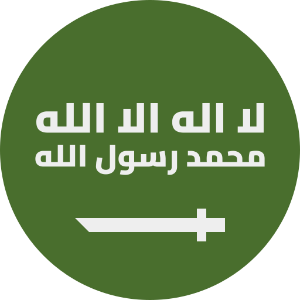<p>Saudi Arabia (<code>sa</code>)</p></div>
  <div><p>Sami</p></div>
  <div><p>Solomon Islands (<code>sb</code>)</p></div>
  <div><p>Seychelles (<code>sc</code>)</p></div>
  <div><p>Sudan (<code>sd</code>)</p></div>
  <div><p>Sweden (<code>se</code>)</p></div>
  <div><p>Singapore (<code>sg</code>)</p></div>
  <div><p>Ascension Island (<code>sh-ac</code>)</p></div>
  <div><p>Saint Helena (<code>sh-hl</code>)</p></div>
  <div><p>Tristan da Cunha (<code>sh-ta</code>)</p></div>
  <div><p>Slovenia (<code>si</code>)</p></div>
  <div><p>Svalbard and Jan Mayen (<code>sj</code>)</p></div>
  <div><p>Slovakia (<code>sk</code>)</p></div>
  <div><p>Sierra Leone (<code>sl</code>)</p></div>
  <div><p>San Marino (<code>sm</code>)</p></div>
  <div><p>Senegal (<code>sn</code>)</p></div>
  <div><p>Somalia (<code>so</code>)</p></div>
  <div>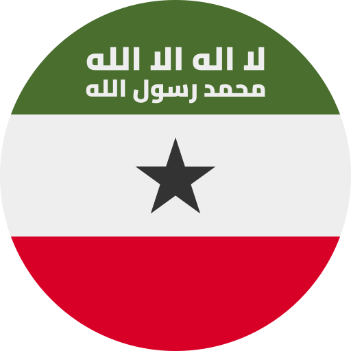<p>Somaliland</p></div>
  <div><p>South Ossetia</p></div>
  <div><p>Soviet Union (<code>su</code>)</p></div>
  <div><p>Suriname (<code>sr</code>)</p></div>
  <div><p>South Sudan (<code>ss</code>)</p></div>
  <div><p>São Tomé and Príncipe (<code>st</code>)</p></div>
  <div><p>El Salvador (<code>sv</code>)</p></div>
  <div><p>Sint Maarten (<code>sx</code>)</p></div>
  <div><p>Syria (<code>sy</code>)</p></div>
  <div>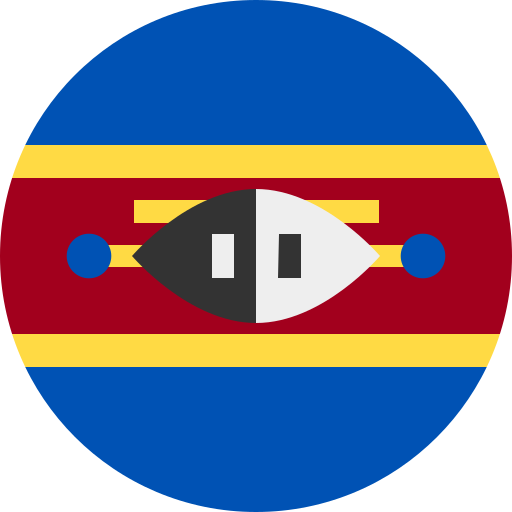<p>Eswatini (<code>sz</code>)</p></div>
  <div><p>Turks and Caicos Islands (<code>tc</code>)</p></div>
  <div><p>Chad (<code>td</code>)</p></div>
  <div><p>French Southern Territories (<code>tf</code>)</p></div>
  <div><p>Togo (<code>tg</code>)</p></div>
  <div><p>Thailand (<code>th</code>)</p></div>
  <div><p>Tibet</p></div>
  <div><p>Tajikistan (<code>tj</code>)</p></div>
  <div><p>Tokelau (<code>tk</code>)</p></div>
  <div><p>Timor-Leste (<code>tl</code>)</p></div>
  <div><p>Turkmenistan (<code>tm</code>)</p></div>
  <div>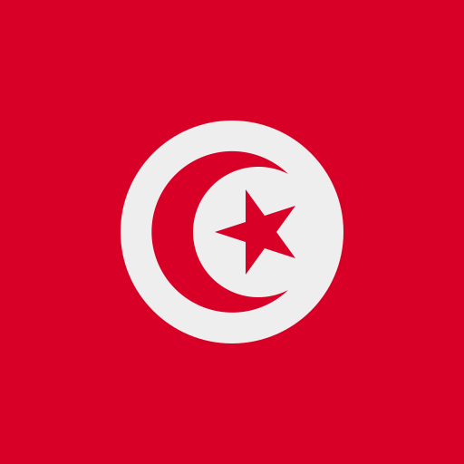<p>Tunisia (<code>tn</code>)</p></div>
  <div><p>Tonga (<code>to</code>)</p></div>
  <div><p>Turkey (<code>tr</code>)</p></div>
  <div><p>Transnistria</p></div>
  <div><p>Trinidad and Tobago (<code>tt</code>)</p></div>
  <div><p>Tuvalu (<code>tv</code>)</p></div>
  <div><p>Taiwan (<code>tw</code>)</p></div>
  <div><p>Tanzania (<code>tz</code>)</p></div>
  <div><p>Tanzania (Zanzibar)</p></div>
  <div><p>Ukraine (<code>ua</code>)</p></div>
  <div><p>Uganda (<code>ug</code>)</p></div>
  <div><p>United States of America (<code>us</code>)</p></div>
  <div><p>Alaska (<code>us-ak</code>)</p></div>
  <div><p>Alabama (<code>us-al</code>)</p></div>
  <div><p>Arkansas (<code>us-ar</code>)</p></div>
  <div><p>Arizona (<code>us-az</code>)</p></div>
  <div><p>California (<code>us-ca</code>)</p></div>
  <div><p>Colorado (<code>us-co</code>)</p></div>
  <div><p>District of Columbia (<code>us-dc</code>)</p></div>
  <div><p>Florida (<code>us-fl</code>)</p></div>
  <div><p>Georgia (<code>us-ga</code>)</p></div>
  <div><p>Hawaii (<code>us-hi</code>)</p></div>
  <div><p>Indiana (<code>us-in</code>)</p></div>
  <div><p>Maryland (<code>us-md</code>)</p></div>
  <div><p>Missouri (<code>us-mo</code>)</p></div>
  <div><p>Mississippi (<code>us-ms</code>)</p></div>
  <div><p>North Carolina (<code>us-nc</code>)</p></div>
  <div><p>New Mexico (<code>us-nm</code>)</p></div>
  <div><p>Oregon (<code>us-or</code>)</p></div>
  <div><p>Rhode Island (<code>us-ri</code>)</p></div>
  <div><p>South Carolina (<code>us-sc</code>)</p></div>
  <div><p>Tennessee (<code>us-tn</code>)</p></div>
  <div><p>Texas (<code>us-tx</code>)</p></div>
  <div><p>Washington (<code>us-wa</code>)</p></div>
  <div><p>Wisconsin (<code>us-wi</code>)</p></div>
  <div><p>Wyoming (<code>us-wy</code>)</p></div>
  <div><p>Betsy Ross</p></div>
  <div><p>Confederate battle</p></div>
  <div><p>United States Minor Outlying Islands (<code>um</code>)</p></div>
  <div><p>Uruguay (<code>uy</code>)</p></div>
  <div><p>Uzbekistan (<code>uz</code>)</p></div>
  <div><p>Holy See (Vatican) (<code>va</code>)</p></div>
  <div><p>Saint Vincent and the Grenadines (<code>vc</code>)</p></div>
  <div><p>Venezuela (<code>ve</code>)</p></div>
  <div><p>Virgin Islands (British) (<code>vg</code>)</p></div>
  <div><p>Virgin Islands (U.S.) (<code>vi</code>)</p></div>
  <div><p>Vietnam (<code>vn</code>)</p></div>
  <div><p>Vanuatu (<code>vu</code>)</p></div>
  <div><p>Wallis and Futuna (<code>wf</code>)</p></div>
  <div><p>Wiphala</p></div>
  <div><p>Samoa (<code>ws</code>)</p></div>
  <div><p>Kosovo (<code>xk</code>)</p></div>
  <div><p>&lt;Placeholder&gt; (<code>xx</code>)</p></div>
  <div><p>Yemen (<code>ye</code>)</p></div>
  <div><p>Yorubaland</p></div>
  <div><p>Mayotte (<code>yt</code>)</p></div>
  <div><p>Yugoslavia (<code>yu</code>)</p></div>
  <div><p>South Africa (<code>za</code>)</p></div>
  <div><p>Zambia (<code>zm</code>)</p></div>
  <div><p>Zimbabwe (<code>zw</code>)</p></div>
</div>

<h2>Language flags</h2>

Usage:
```text
https://hatscripts.github.io/circle-flags/flags/language/xx.svg
```
(Where `xx` is the [ISO 639-1 code](https://en.wikipedia.org/wiki/List_of_ISO_639_language_codes) of a language).

<div class="container">
  <div><p>Afar (<code>aa</code>)</p></div>
  <div><p>Abkhazian (<code>ab</code>)</p></div>
  <div><p>Afrikaans (<code>af</code>)</p></div>
  <div><p>Akan (<code>ak</code>)</p></div>
  <div><p>Amharic (<code>am</code>)</p></div>
  <div><p>Aragonese (<code>an</code>)</p></div>
  <div><p>Arabic (<code>ar</code>)</p></div>
  <div><p>Assamese (<code>as</code>)</p></div>
  <div><p>Avaric (<code>av</code>)</p></div>
  <div><p>Aymara (<code>ay</code>)</p></div>
  <div><p>Azerbaijani (<code>az</code>)</p></div>
  <div><p>Bashkir (<code>ba</code>)</p></div>
  <div><p>Belarusian (<code>be</code>)</p></div>
  <div><p>Bulgarian (<code>bg</code>)</p></div>
  <div><p>Bislama (<code>bi</code>)</p></div>
  <div><p>Bambara (<code>bm</code>)</p></div>
  <div><p>Bengali (<code>bn</code>)</p></div>
  <div><p>Tibetan (<code>bo</code>)</p></div>
  <div><p>Breton (<code>br</code>)</p></div>
  <div><p>Bosnian (<code>bs</code>)</p></div>
  <div><p>Catalan (<code>ca</code>)</p></div>
  <div><p>Chechen (<code>ce</code>)</p></div>
  <div><p>Cebuano (<code>ceb</code>)</p></div>
  <div><p>Chamorro (<code>ch</code>)</p></div>
  <div><p>Mari (<code>chm</code>)</p></div>
  <div><p>Sorani Kurdish (<code>ckb</code>)</p></div>
  <div><p>Corsican (<code>co</code>)</p></div>
  <div><p>Czech (<code>cs</code>)</p></div>
  <div><p>Chuvash (<code>cv</code>)</p></div>
  <div><p>Welsh (<code>cy</code>)</p></div>
  <div><p>Danish (<code>da</code>)</p></div>
  <div><p>German (<code>de</code>)</p></div>
  <div><p>Dhivehi (<code>dv</code>)</p></div>
  <div><p>Dzongkha (<code>dz</code>)</p></div>
  <div><p>Ewe (<code>ee</code>)</p></div>
  <div><p>Greek (<code>el</code>)</p></div>
  <div><p>English (<code>en</code>)</p></div>
  <div><p>English (Australia) (<code>en-au</code>)</p></div>
  <div><p>English (Canada) (<code>en-ca</code>)</p></div>
  <div><p>English (Ghana) (<code>en-gh</code>)</p></div>
  <div><p>English (Hong Kong) (<code>en-hk</code>)</p></div>
  <div><p>English (Ireland) (<code>en-ie</code>)</p></div>
  <div><p>English (India) (<code>en-in</code>)</p></div>
  <div><p>English (Kenya) (<code>en-ke</code>)</p></div>
  <div><p>English (Nigeria) (<code>en-ng</code>)</p></div>
  <div><p>English (New Zealand) (<code>en-nz</code>)</p></div>
  <div><p>English (Philippines) (<code>en-ph</code>)</p></div>
  <div><p>English (Singapore) (<code>en-sg</code>)</p></div>
  <div><p>English (Tanzania) (<code>en-tz</code>)</p></div>
  <div><p>English (United States) (<code>en-us</code>)</p></div>
  <div><p>English (South Africa) (<code>en-za</code>)</p></div>
  <div><p>Esperanto (<code>eo</code>)</p></div>
  <div><p>Spanish (<code>es</code>)</p></div>
  <div><p>Spanish (Mexico) (<code>es-mx</code>)</p></div>
  <div><p>Estonian (<code>et</code>)</p></div>
  <div><p>Basque (<code>eu</code>)</p></div>
  <div><p>Persian (<code>fa</code>)</p></div>
  <div><p>Finnish (<code>fi</code>)</p></div>
  <div><p>Filipino (<code>fil</code>)</p></div>
  <div><p>Fijian (<code>fj</code>)</p></div>
  <div><p>Faroese (<code>fo</code>)</p></div>
  <div><p>French (<code>fr</code>)</p></div>
  <div><p>Western Frisian (<code>fy</code>)</p></div>
  <div><p>Irish (<code>ga</code>)</p></div>
  <div><p>Scottish Gaelic (<code>gd</code>)</p></div>
  <div><p>Galician (<code>gl</code>)</p></div>
  <div><p>Guarani (<code>gn</code>)</p></div>
  <div><p>Gujarati (<code>gu</code>)</p></div>
  <div><p>Manx (<code>gv</code>)</p></div>
  <div><p>Hausa (<code>ha</code>)</p></div>
  <div><p>Hawaiian (<code>haw</code>)</p></div>
  <div><p>Hebrew (<code>he</code>)</p></div>
  <div><p>Hindi (<code>hi</code>)</p></div>
  <div><p>Hmong (<code>hmn</code>)</p></div>
  <div><p>Hiri Motu (<code>ho</code>)</p></div>
  <div><p>Croatian (<code>hr</code>)</p></div>
  <div><p>Haitian Creole (<code>ht</code>)</p></div>
  <div><p>Hungarian (<code>hu</code>)</p></div>
  <div><p>Armenian (<code>hy</code>)</p></div>
  <div><p>Interlingua (<code>ia</code>)</p></div>
  <div><p>Indonesian (<code>id</code>)</p></div>
  <div><p>Interlingue (<code>ie</code>)</p></div>
  <div><p>Igbo (<code>ig</code>)</p></div>
  <div><p>Ilocano (<code>ilo</code>)</p></div>
  <div><p>Interslavic</p></div>
  <div><p>Ido (<code>io</code>)</p></div>
  <div><p>Icelandic (<code>is</code>)</p></div>
  <div><p>Italian (<code>it</code>)</p></div>
  <div><p>Japanese (<code>ja</code>)</p></div>
  <div><p>Javanese (<code>jv</code>)</p></div>
  <div><p>Georgian (<code>ka</code>)</p></div>
  <div><p>Kongo (<code>kg</code>)</p></div>
  <div><p>Kikuyu (<code>ki</code>)</p></div>
  <div><p>Kazakh (<code>kk</code>)</p></div>
  <div><p>Greenlandic (<code>kl</code>)</p></div>
  <div><p>Khmer (<code>km</code>)</p></div>
  <div><p>Kannada (<code>kn</code>)</p></div>
  <div><p>Korean (<code>ko</code>)</p></div>
  <div><p>Kanuri (<code>kr</code>)</p></div>
  <div><p>Krio (<code>kri</code>)</p></div>
  <div><p>Kashmiri (<code>ks</code>)</p></div>
  <div><p>Kurdish (<code>ku</code>)</p></div>
  <div><p>Komi (<code>kv</code>)</p></div>
  <div><p>Cornish (<code>kw</code>)</p></div>
  <div><p>Kyrgyz (<code>ky</code>)</p></div>
  <div><p>Latin (<code>la</code>)</p></div>
  <div><p>Luxembourgish (<code>lb</code>)</p></div>
  <div><p>Ganda (<code>lg</code>)</p></div>
  <div><p>Lingala (<code>ln</code>)</p></div>
  <div><p>Lao (<code>lo</code>)</p></div>
  <div><p>Lithuanian (<code>lt</code>)</p></div>
  <div><p>Luba-Katanga (<code>lu</code>)</p></div>
  <div><p>Mizo (<code>lus</code>)</p></div>
  <div><p>Latvian (<code>lv</code>)</p></div>
  <div><p>Malagasy (<code>mg</code>)</p></div>
  <div><p>Marshallese (<code>mh</code>)</p></div>
  <div><p>Māori (<code>mi</code>)</p></div>
  <div><p>Macedonian (<code>mk</code>)</p></div>
  <div><p>Malayalam (<code>ml</code>)</p></div>
  <div><p>Mongolian (<code>mn</code>)</p></div>
  <div><p>Meitei (<code>mni</code>)</p></div>
  <div><p>Marathi (<code>mr</code>)</p></div>
  <div><p>Western Mari (<code>mrj</code>)</p></div>
  <div><p>Malay (<code>ms</code>)</p></div>
  <div><p>Maltese (<code>mt</code>)</p></div>
  <div><p>Burmese (<code>my</code>)</p></div>
  <div><p>Nauru (<code>na</code>)</p></div>
  <div><p>Norwegian Bokmål (<code>nb</code>)</p></div>
  <div><p>Northern Ndebele (<code>nd</code>)</p></div>
  <div><p>Nepali (<code>ne</code>)</p></div>
  <div><p>Dutch (<code>nl</code>)</p></div>
  <div><p>Norwegian Nynorsk (<code>nn</code>)</p></div>
  <div><p>Norwegian (<code>no</code>)</p></div>
  <div><p>Old Norse (<code>non</code>)</p></div>
  <div><p>Southern Ndebele (<code>nr</code>)</p></div>
  <div><p>Chichewa (<code>ny</code>)</p></div>
  <div><p>Occitan (<code>oc</code>)</p></div>
  <div><p>Oromo (<code>om</code>)</p></div>
  <div><p>Odia (<code>or</code>)</p></div>
  <div><p>Ossetian (<code>os</code>)</p></div>
  <div><p>Otomi (<code>oto</code>)</p></div>
  <div><p>Punjabi (<code>pa</code>)</p></div>
  <div><p>Papiamento (<code>pap</code>)</p></div>
  <div><p>Polish (<code>pl</code>)</p></div>
  <div><p>Piedmontese (<code>pms</code>)</p></div>
  <div><p>Pashto (<code>ps</code>)</p></div>
  <div><p>Portuguese (<code>pt</code>)</p></div>
  <div><p>Portuguese (Brazil) (<code>pt-br</code>)</p></div>
  <div><p>Quechua (<code>qu</code>)</p></div>
  <div><p>Romansh (<code>rm</code>)</p></div>
  <div><p>Rundi (<code>rn</code>)</p></div>
  <div><p>Romanian (<code>ro</code>)</p></div>
  <div><p>Russian (<code>ru</code>)</p></div>
  <div><p>Kinyarwanda (<code>rw</code>)</p></div>
  <div><p>Sardinian (<code>sc</code>)</p></div>
  <div><p>Sindhi (<code>sd</code>)</p></div>
  <div><p>Northern Sami (<code>se</code>)</p></div>
  <div><p>Sango (<code>sg</code>)</p></div>
  <div><p>Sinhala (<code>si</code>)</p></div>
  <div><p>Slovak (<code>sk</code>)</p></div>
  <div><p>Slovenian (<code>sl</code>)</p></div>
  <div><p>Samoan (<code>sm</code>)</p></div>
  <div><p>Shona (<code>sn</code>)</p></div>
  <div><p>Somali (<code>so</code>)</p></div>
  <div><p>Albanian (<code>sq</code>)</p></div>
  <div><p>Serbian (<code>sr</code>)</p></div>
  <div><p>Swazi (<code>ss</code>)</p></div>
  <div><p>Southern Sotho (<code>st</code>)</p></div>
  <div><p>Sundanese (<code>su</code>)</p></div>
  <div><p>Swedish (<code>sv</code>)</p></div>
  <div><p>Swahili (<code>sw</code>)</p></div>
  <div><p>Tamil (<code>ta</code>)</p></div>
  <div><p>Telugu (<code>te</code>)</p></div>
  <div><p>Tajik (<code>tg</code>)</p></div>
  <div><p>Thai (<code>th</code>)</p></div>
  <div><p>Tigrinya (<code>ti</code>)</p></div>
  <div><p>Turkmen (<code>tk</code>)</p></div>
  <div><p>Tagalog (<code>tl</code>)</p></div>
  <div><p>Tswana (<code>tn</code>)</p></div>
  <div><p>Tongan (<code>to</code>)</p></div>
  <div><p>Turkish (<code>tr</code>)</p></div>
  <div><p>Translingual</p></div>
  <div><p>Tatar (<code>tt</code>)</p></div>
  <div><p>Tahitian (<code>ty</code>)</p></div>
  <div><p>Udmurt (<code>udm</code>)</p></div>
  <div><p>Uyghur (<code>ug</code>)</p></div>
  <div><p>Ukrainian (<code>uk</code>)</p></div>
  <div><p>Urdu (<code>ur</code>)</p></div>
  <div><p>Uzbek (<code>uz</code>)</p></div>
  <div><p>Vietnamese (<code>vi</code>)</p></div>
  <div><p>Volapük (<code>vo</code>)</p></div>
  <div><p>Xhosa (<code>xh</code>)</p></div>
  <div><p>&lt;Placeholder&gt; (<code>xx</code>)</p></div>
  <div><p>Yiddish (<code>yi</code>)</p></div>
  <div><p>Yoruba (<code>yo</code>)</p></div>
  <div><p>Yucatec Maya (<code>yua</code>)</p></div>
  <div><p>Chinese (<code>zh</code>)</p></div>
  <div><p>Zulu (<code>zu</code>)</p></div>
</div>

<h2>Other flags</h2>

<div class="container">
  <div><p>Checkered</p></div>
  <div><p>Earth</p></div>
  <div><p>Klingon</p></div>
  <div><p>LGBT</p></div>
  <div><p>Progress Pride</p></div>
  <div><p>Transgender</p></div>
  <div><p>Mars</p></div>
  <div><p>NATO</p></div>
  <div><p>Olympics</p></div>
  <div><p>Pirate</p></div>
  <div><p>United Nations</p></div>
</div>
